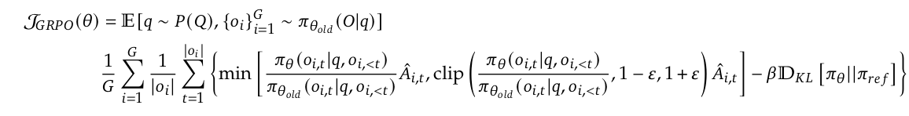

# Group Relative Policy Optimization (GRPO)

Group Relative Policy Optimization (GRPO) is an algorithm proposed by Deepseek for training large language models with reinforcement learning. This repository aggregates and refactors **four distinct open-source implementations** of GRPO, each demonstrating different systems choices - generation backends, reference model handling, training frameworks, and reward design - while sharing the same core algorithm.

## Algorithm

GRPO eliminates the need for additional value function approximation by using the average reward of multiple sampled responses to the same query as the baseline, significantly reducing computational and memory overhead in reinforcement learning training. This approach maintains policy optimization stability while removing the complexity of training a value function.

For each question $q$, GRPO samples a group of outputs $\{o_1, o_2, \cdots, o_G\}$ from the old policy $\pi_{\theta_{old}}$ and then optimizes the policy model by maximizing the following objective:



Instead of adding KL penalty in the reward, GRPO regularizes by directly adding the KL divergence between the trained policy and the reference policy to the loss, avoiding complicating the calculation of $\hat{A}_{i,t}$. The KL divergence is estimated with the following unbiased estimator, which is guaranteed to be positive:

<div align="center">
    
</div>

&nbsp;

A reward function is then used to score the outputs, yielding $G$ rewards $\mathbf{r}=\{R(q, o_1), R(q, o_2), \cdots, R(q, o_G)\}$ correspondingly. These rewards are normalized by subtracting the group average and dividing by the group standard deviation. The normalized rewards for each output $o_i$ define the advantages $\hat{A}_{i, t}$ for all tokens in the output. The policy is then optimized by maximizing the GRPO objective.

<div align="center">
    
</div>

where,

- $\pi_{\theta}$ and $\pi_{\theta_{old}}$ are the current and old policy models,
- $\pi_{ref}$ is the reference model
- $q$ are questions from the question dataset
- $o$ are outputs sampled from the old policy $\pi_{\theta_{old}}$
- $R(q, o_i)$ is the reward for output $o_i$ to question $q$
- $\epsilon$ is a clipping-related hyper-parameter introduced in PPO for stabilizing training.
- $\beta$ is the coefficient of the KL penalty
- $\hat{A}_{i,t}$ is the advantage calculated based on relative rewards of the outputs inside each group (note: the advantage value is constant for all tokens within a single output sequence).

&nbsp;

<div style="border: 1px solid #ccc; padding: 15px; font-family: monospace;">
<pre>
<b>Algorithm:</b>
Input initial policy model π<sub>θ<sub>init</sub></sub>; reward function r<sub>φ</sub>; task prompts 𝓓; hyperparameters ε, β, μ
1: policy model π<sub>θ</sub> ← π<sub>θ<sub>init</sub></sub>
2: <b>for</b> iteration = 1, ..., I <b>do</b>
3:     reference model π<sub>ref</sub> ← π<sub>θ</sub>
4:     <b>for</b> step = 1, ..., M <b>do</b>
5:         Sample a batch 𝓓<sub>b</sub> from 𝓓
6:         Update the old policy model π<sub>θ<sub>old</sub></sub> ← π<sub>θ</sub>
7:         Sample G outputs {o<sub>i</sub>}<sup>G</sup><sub>i=1</sub> ∼ π<sub>θ<sub>old</sub></sub>(·|q) for each question q ∈ 𝓓<sub>b</sub>
8:         Compute rewards {r<sub>i</sub>}<sup>G</sup><sub>i=1</sub> = {R(q, o<sub>1</sub>), R(q, o<sub>2</sub>), ..., R(q, o<sub>G</sub>)} for each output o<sub>i</sub> using r<sub>φ</sub>
9:         Compute output-level advantage:
               Â<sub>i</sub> = (R(q, o<sub>i</sub>) - mean(R(q, o<sub>1</sub>), ..., R(q, o<sub>G</sub>))) / std(R(q, o<sub>1</sub>), ..., R(q, o<sub>G</sub>))
               and set Â<sub>i,t</sub> = Â<sub>i</sub> for all tokens t in output o<sub>i</sub> (constant within each output)
10:        <b>for</b> GRPO iteration = 1, ..., μ <b>do</b>
11:            Update the policy model π<sub>θ</sub> by maximizing the GRPO objective
<b>Output</b> π<sub>θ</sub>
</pre>
</div>

## Implementations

We provide four refactored implementations of GRPO, each with a different focus and design:

### 1. [nanoAhaMoment](src/grpo/nano_aha_moment)

An implementation from [nanoAhaMoment](https://github.com/McGill-NLP/nano-aha-moment), that separates each step of the GRPO loop into distinct components. It uses a rule-based reward function for a Countdown task and integrates with vLLM for efficient generation.

- Modular pipeline with separated components
- vLLM integration for efficient generation
- DeepSpeed training backend
- Format: `<think>...</think>\n<answer>...</answer>`
- Rule-based reward functions for Countdown tasks

### 2. [GRPO:Zero](src/grpo/grpo_zero)

An implementation from [GRPO-Zero](https://github.com/policy-gradient/GRPO-Zero), built on a custom Transformer and Tokenizer stack that loads Qwen2.5-3B-Instruct weights directly. It uses the Countdown task with YAML-driven configuration and TensorBoard logging.

- Custom Transformer/Tokenizer loading Qwen2.5-3B-Instruct weights
- Countdown-Tasks-3to4 dataset
- YAML configuration, TensorBoard logging
- Normalized-reward policy gradient update
- Reward Function: Combined reward for correctness and format

### 3. [Simple GRPO](src/grpo/simple_grpo)

An implementation from [Simple GRPO](https://github.com/lsdefine/simple_GRPO), that offloads reference model log-probability computation to a separate Bottle HTTP server. It uses DeepSpeed for training with a policy gradient loss, KL penalty, and optional PPO-style clipping.

- Qwen2.5-7B base model
- Bottle HTTP server for reference model log-probabilities
- GSM8K dataset
- DeepSpeed distributed training
- KL divergence penalty term
- Per-token advantage calculation with optional clipped ratio
- Loss Calculation: `loss = -(policy_ratio * advantage - beta * kl_divergence)`

### 4. [GRPO from Scratch](src/grpo/andriy_burkov_lm_book)

An implementation from ["The LM Book" by Andriy Burkov](https://github.com/aburkov/theLMbook/blob/main/GRPO.py), that demonstrates the core GRPO algorithm step-by-step. It uses a copy of the reference model and performs multiple updates per batch.

- Periodic reference model updates
- Multiple updates per batch (μ-PPO)
- Comprehensive reward decomposition
- Memory optimization techniques
- Reward Function: Combined reward for correctness and format

## Architecture Comparison

| | nanoAhaMoment | GRPO:Zero | Simple GRPO | GRPO from Scratch |
|---|---|---|---|---|
| **Task / Model** | Countdown / Qwen2.5-3B (base) | Countdown / Qwen2.5-3B-Instruct | GSM8K / Qwen2.5-7B (base) | GSM8K / Qwen2.5-0.5B-Instruct |
| **Policy Objective** | REINFORCE + KL | Pure REINFORCE | PPO-clip + KL | PPO-clip + KL |
| **Group Size (G)** | 4 | 8 | 8 | 16 |
| **Updates per Rollout (μ)** | 1 | 1 | 1 | 1–N (configurable) |
| **Reference Policy** | DeepSpeed engine, CPU-offloaded | None | Separate Bottle HTTP server | `copy.deepcopy()` per outer iteration |
| **Generation Backend** | vLLM with sleep/wake GPU sharing | Custom KV-cache loop | `model.generate()` + captured gen log probs | `model.generate()` with prompt expansion |
| **Training Framework** | DeepSpeed ZeRO-2 | Pure PyTorch + MemoryEfficientAdamW | DeepSpeed ZeRO-2 + optimizer CPU offload | Pure PyTorch + Adam |
| **KL Coefficient (β)** | 0.001 | None | 0.04 | 0.04 |
| **Clip Parameter (ε)** | None | None | 0.2 | 0.1 |
| **Format Tags** | `<think>` / `<answer>` | `<think>` / `<answer>` | `<think>` / `<answer>` | `<reasoning>` / `<answer>` |
| **Reward Range** | 0–2 | 0–1.1 | −2 to 2.25 | 0–2.8 |
| **Optimizer / LR** | AdamW / 1e-6 | MemoryEfficientAdamW / 1e-5 | AdamW (CPU-offloaded) / 1e-6 | Adam / 5e-6 |
| **Grad Clip** | 1.0 | 1.0 | DeepSpeed default | 0.1 |
| **Checkpoint Format** | HF model + DeepSpeed state | `torch.save(state_dict)` | `save_pretrained` | `save_pretrained` |
| **Logging** | WandB | TensorBoard | stdout only | stdout only |

### Generation Backend

The sharpest divergence across the four implementations.

- **nanoAhaMoment** - Dedicated vLLM engine with `enable_sleep_mode=True`. vLLM sleeps during the training backward pass and wakes up after, with updated weights pushed in via `load_weights`. Gives PagedAttention throughput without competing with DeepSpeed for GPU memory.
- **GRPO:Zero** - Fully custom autoregressive loop with explicit KV-cache management (`init_kv_cache` / `inference` / `del_kv_cache`), generating one token at a time. Most transparent but least optimized.
- **Simple GRPO** - HuggingFace `model.generate()` with `num_return_sequences=8`. Also captures generation-time log probs (`gen_logps`) in inference mode and ships them to the reference server, enabling PPO ratio clipping against the exact policy that produced the samples.
- **GRPO from Scratch** - Same `model.generate()` path, but called on the training model itself after expanding prompts with `repeat_interleave`. No process separation; generation and training compete for the same GPU memory.

### Reference Policy Handling

- **nanoAhaMoment** - Second full model copy wrapped in a DeepSpeed inference engine. Moved to GPU to score log probs, then offloaded back to CPU after each gradient accumulation boundary.
- **GRPO:Zero** - No reference model. Pure REINFORCE: `loss = -(log_probs × advantages).sum() / num_tokens`. Policy is unconstrained.
- **Simple GRPO** - Frozen reference model runs in a **separate process** behind a Bottle HTTP server on port 59875. Training process POSTs serialized tensors, server responds with reference log probs. Fully decouples the reference GPU from the training GPU.
- **GRPO from Scratch** - `copy.deepcopy(policy_model)` at the start of each outer iteration, then frozen for that iteration. Reference lags by one outer iteration rather than being fixed at initialization.

### Loss Function

All three KL-regularized implementations use the unbiased estimator `exp(ref − policy) − (ref − policy) − 1`, which is guaranteed non-negative.

- **nanoAhaMoment** - `loss = (-logps × adv + β × KL).sum() / total_response_tokens`. β=0.001 keeps KL as a soft constraint.
- **GRPO:Zero** - `loss = -(log_probs × adv × mask).sum() / num_tokens`. No KL term; policy is free to drift.
- **Simple GRPO** - PPO clipped surrogate: `loss = -(min(r×adv, clip(r, 1±0.2)×adv) − β×KL)`. Ratio `r` is measured against generation-time log probs, not the current model.
- **GRPO from Scratch** - Same PPO clip form with ε=0.1 and β=0.04, measured against log probs from the start of the inner step (`old_log_probs`).

### Advantage Computation

All four z-score rewards within a group: `(r − mean) / (std + 1e-4)`. The differences are in grouping and degenerate-batch handling.

- **nanoAhaMoment** - Group of 4 per prompt; scalar advantage broadcast to every token in the response.
- **GRPO:Zero** - Groups keyed by raw prefix string via `defaultdict`; normalized scalar stored back into `episode.reward`.
- **Simple GRPO** - Normalizes across all 8 responses for a question before uploading. Skips batches where `max − min < 0.01` to avoid zero-variance degenerate updates.
- **GRPO from Scratch** - Groups of 16; reshapes reward tensor to `(-1, 16)`, normalizes per row, then unsqueezes for token-level broadcasting. Largest group size yields the most stable advantage estimates.

### Reward Design

| | Format Signal | Correctness Signal | Range |
|---|---|---|---|
| **nanoAhaMoment** | 0 / 0.5 / 1.0 (format + answer purity) | 0 or 1.0 (equation correct, all numbers used) | 0–2 |
| **GRPO:Zero** | 0 / 0.1 / 0.5 / 1.0 × 0.1 weight | 0 or 1.0 (equation correct, all numbers used) | 0–1.1 |
| **Simple GRPO** | −1 or +1.25 (binary pass/fail) | −1 or +1.0 (via `math_verify` library) | −2 to 2.25 |
| **GRPO from Scratch** | +0.2 per tag (4 tags, max 0.8) | +2.0 exact / +1.5 numeric / 0 wrong | 0–2.8 |

Key differences in reward design:

- **Negative rewards** - Only Simple GRPO penalizes failures (−1), giving stronger gradient signal on bad outputs.
- **Verification method** - Simple GRPO uses the external `math_verify` library; the others use `literal_eval` or regex on extracted equations.
- **Format weighting** - GRPO:Zero multiplies format reward by 0.1, making answer correctness dominate. GRPO from Scratch gives independent partial credit per XML tag.
- **Format prompt** - nanoAhaMoment and GRPO:Zero pre-fill the assistant turn with `"Let me solve this step by step.\n<think>"` to nudge the base model. GRPO from Scratch uses `<reasoning>` tags and builds prompts manually without `apply_chat_template`.

### Similarities

- **Algorithm** - All implement group-relative advantage normalization from the DeepSeekMath paper: sample G outputs, z-score rewards within each group, optimize a policy gradient loss.
- **KL estimator** - Three of four use the same unbiased `exp(r − p) − (r − p) − 1` estimator.
- **Precision** - All train in bfloat16.
- **Loss masking** - All mask prompt tokens from the loss; gradients flow only through generated response tokens.
- **Model family** - All use Qwen2.5 (0.5B, 3B, or 7B).
- **Output format** - All enforce a structured reasoning + answer format, differing only in tag names (`<think>` vs `<reasoning>`).

## Repository Structure

```
src/grpo/
├── nano_aha_moment/        # vLLM + DeepSpeed pipeline (Countdown)
│   ├── nano_r1_train.py
│   ├── config.py
│   ├── episode_creation.py
│   ├── reward_functions.py
│   ├── policy_gradient_loss.py
│   └── utils.py
├── grpo_zero/              # Custom Transformer + Tokenizer (Countdown)
│   ├── train.py
│   ├── grpo.py
│   ├── qwen2_model.py
│   ├── tokenizer.py
│   ├── countdown_task.py
│   ├── optimizer.py
│   ├── data_types.py
│   └── config.yaml
├── simple_grpo/            # Reference server + DeepSpeed (GSM8K)
│   ├── train_grpo.py
│   ├── ref_model_server.py
│   ├── completions.py
│   └── reward_functions.py
└── andriy_burkov_lm_book/  # Pure PyTorch GRPO loop (GSM8K)
    ├── train_grpo.py
    ├── data_process.py
    ├── completions.py
    ├── evaluation.py
    └── reward_functions.py
```

## References

[1] [DeepSeekMath: Pushing the Limits of Mathematical Reasoning in Open Language Models](https://arxiv.org/abs/2402.03300)
